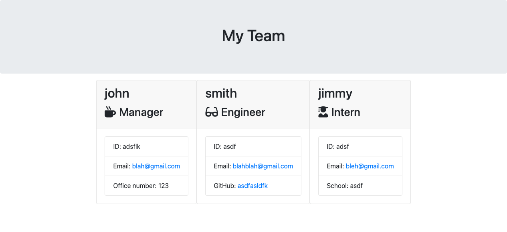

# template-engine

## Purpose

This Repository is being used to develop and display a employee template application that will take in CLI answers to prompts and register employees in an html file.


Link to Github Repository
https://github.com/Marquez-Brown/template-engine

## Usage
````

- install node.js
- install npm
- use npm install to install the require dependencies

- type ( node app.js ) in order to run the file

- answer the prompts
  
- when template-engine asks if you would like to add another employee, type ( n ) and press enter to have your team.html file created

follow the link for video of usage
https://drive.google.com/file/d/1FMz4yywo5x5RpmDO6sq9ET2W1qikAL81/view

````



## If you would like to contribute

To help with adding functionality, debugging, or refactoring the code, please ask for a clone of the repo, make the changes along with comments for overview and permission to push.

## Contributors / Credit

NA


[](https://opensource.org/licenses/MIT)

MIT License
Copyright (c) [2020] [(MB inc.) Georgia Tech Bootcamp Project]

Permission is hereby granted, free of charge, to any person obtaining a copy
of this software and associated documentation files (the "Software"), to deal
in the Software without restriction, including without limitation the rights
to use, copy, modify, merge, publish, distribute, sublicense, and/or sell
copies of the Software, and to permit persons to whom the Software is
furnished to do so, subject to the following conditions:

The above copyright notice and this permission notice shall be included in all
copies or substantial portions of the Software.

THE SOFTWARE IS PROVIDED "AS IS", WITHOUT WARRANTY OF ANY KIND, EXPRESS OR
IMPLIED, INCLUDING BUT NOT LIMITED TO THE WARRANTIES OF MERCHANTABILITY,
FITNESS FOR A PARTICULAR PURPOSE AND NONINFRINGEMENT. IN NO EVENT SHALL THE
AUTHORS OR COPYRIGHT HOLDERS BE LIABLE FOR ANY CLAIM, DAMAGES OR OTHER
LIABILITY, WHETHER IN AN ACTION OF CONTRACT, TORT OR OTHERWISE, ARISING FROM,
OUT OF OR IN CONNECTION WITH THE SOFTWARE OR THE USE OR OTHER DEALINGS IN THE
SOFTWARE.
